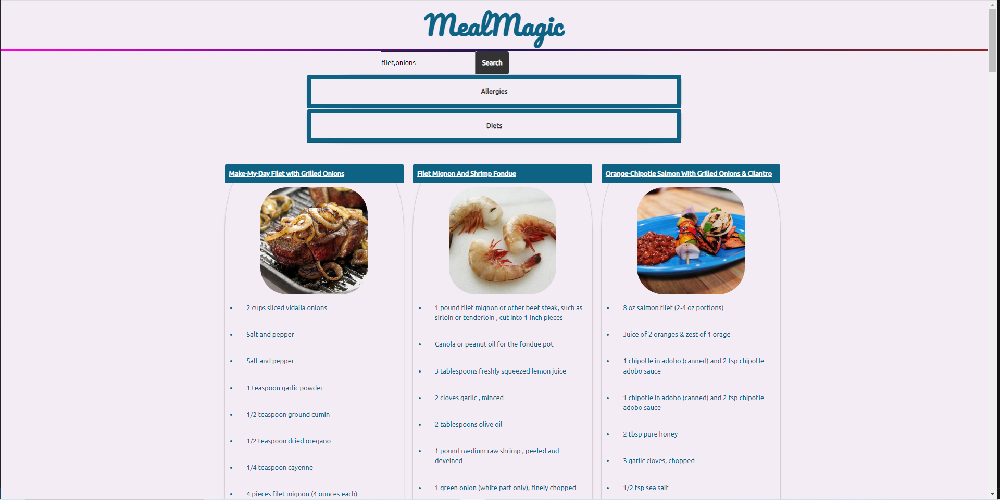
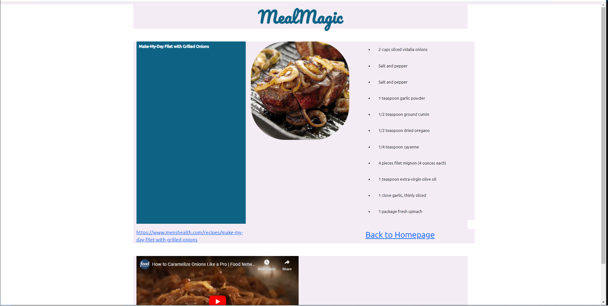
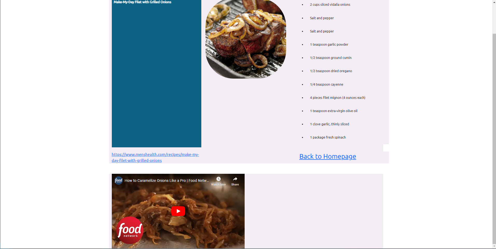

# meal-magic
This application will take input from a user and return a list of recipes that can be made what includes those ingredients

## how-to-use
You can type in multiple parameters just separate multiple words with a comma, once you have typed your chosen ingredients, you can choose dietary restrictions under the "diet" drop-down or allergy restrictions under the "allergies" drop down. Once satisfied, click "search". You will be shown results with ingredients you chose. If you see something you would like to make, click on the name and it will bring you to another page to show the ingredients, a youtube video (if one is available for that item), and the original link to the full recipe site. Once done you can click the "back to hompage" button to start over.

## where-to-find
important links:

github repo: https://github.com/MCKIT77/meal-magic

github pages: https://mckit77.github.io/meal-magic/

## api-usage
edamam api: "https://api.edamam.com/api/recipes/v2"

youtube api: "https://www.googleapis.com/youtube/v3"

## how-it-looks

